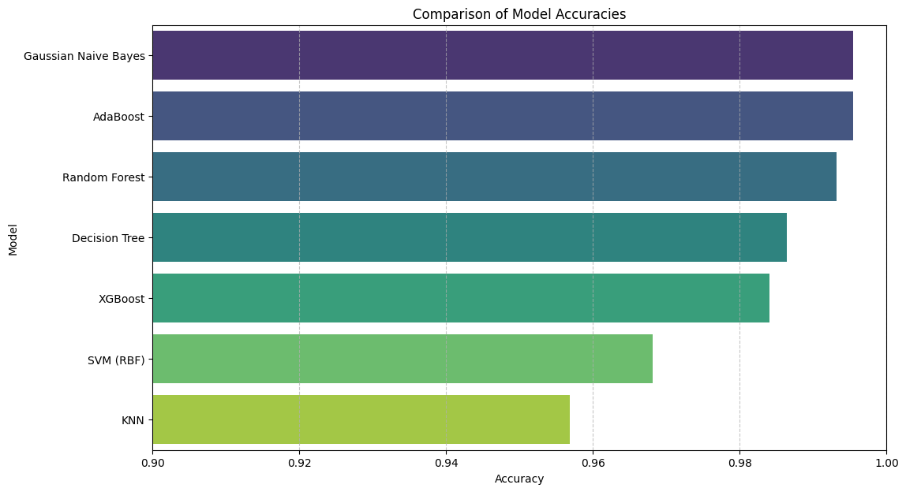

# Smart Crop Recommendation System using Machine Learning

An end-to-end Machine Learning project that recommends the optimal crop to cultivate based on specific soil nutrition and climatic parameters. This tool aims to assist farmers and agricultural engineers in maximizing yield by optimizing crop selection based on precise environmental data.

## 📌 Dataset Source
The dataset used for this project is sourced from Kaggle:
👉 [Crop Recommendation Dataset by Madhura Atmaram Bhagat](https://www.kaggle.com/datasets/madhuraatmarambhagat/crop-recommendation-dataset)

## 📊 Dataset Structure
The dataset contains **2,200 entries** and **8 columns**. It features 22 unique crop categories (target variable) with a completely balanced dataset containing zero missing values.

### Input Features (7 Columns):
* **N**: Nitrogen content in the soil (Integer)
* **P**: Phosphorus content in the soil (Integer)
* **K**: Potassium content in the soil (Integer)
* **temperature**: Temperature in Celsius (Float)
* **humidity**: Relative humidity in percentage (Float)
* **ph**: pH value of the soil (Float)
* **rainfall**: Rainfall in millimeters (Float)

### 🏷️ Target Crop Mapping
The categorical crop labels are encoded into integer values (`0` through `21`) according to the following index mapping:

| Index | Crop Name | Index | Crop Name | Index | Crop Name |
| :---: | :--- | :---: | :--- | :---: | :--- |
| **0** | Apple | **8** | Jute | **16** | Orange |
| **1** | Banana | **9** | Kidney Beans | **17** | Papaya |
| **2** | Blackgram | **10** | Lentil | **18** | Pigeonpeas |
| **3** | Chickpea | **11** | Maize | **19** | Pomegranate |
| **4** | Coconut | **12** | Mango | **20** | Rice |
| **5** | Coffee | **13** | Mothbeans | **21** | Watermelon |
| **6** | Cotton | **14** | Mungbean | | |
| **7** | Grapes | **15** | Muskmelon | | |

---

## 🚀 Model Evaluation & Results
Due to strong feature separability in the data, the trained models achieved exceptional predictive performance. The models were evaluated on a validation split of 440 samples:

| Model Name | Accuracy |
| :--- | :---: |
| **AdaBoost** | **99.55%** |
| **Gaussian Naive Bayes** | **99.55%** |
| **Random Forest** | **99.32%** |
| **Decision Tree** | **98.64%** |
| **XGBoost** | **98.41%** |
| **SVM (RBF Kernel)** | **96.81%** |
| **K-Nearest Neighbors (KNN)** | **95.68%** |

### Model Accuracy Comparison Graph
<<<<<<< HEAD
 
====================================================
 
=======


>>>>>>> 3303aea (update on README)
### Deep-Dive Performance (AdaBoost / Gaussian NB)
Both AdaBoost and Naive Bayes successfully classified **438 out of 440 samples** correctly, achieving the top overall accuracy. 

While 20 out of the 22 crop classes achieved perfect 1.00 scores across all metrics, the model revealed a minor boundary overlap between **Jute (Class 8)** and **Rice (Class 20)**:

| Crop Class | Precision | Recall | F1-Score | Support |
| :--- | :---: | :---: | :---: | :---: |
| **Class 8 (Jute)** | 0.92 | 1.00 | 0.96 | 23 |
| **Class 20 (Rice)** | 1.00 | 0.89 | 0.94 | 19 |
| **Macro Average** | **1.00** | **1.00** | **1.00** | **440** |
| **Weighted Average** | **1.00** | **1.00** | **1.00** | **440** |

> 🔍 **Key Analytical Insight:** The model missed exactly 2 samples of **Rice**, mistakenly predicting them as **Jute** (causing Rice's recall to drop to 0.89, and Jute's precision to drop to 0.92). In agricultural terms, this makes complete sense: both jute and rice thrive under incredibly high tropical rainfall and saturated soil moisture thresholds, causing a minor overlap at the extreme boundaries of their feature spaces.

---

## 📂 Repository Directory Structure
```text
├── data/
│   └── Crop_recommendation.csv    # The 2200-row crop dataset
├── models/
│   ├── ada_model.pkl              # Saved production AdaBoost model
│   └── nb_model.pkl               # Saved production Gaussian Naive Bayes model
├── notebooks/
│   └── Crop_Prediction.ipynb      # Jupyter notebook for EDA & training
├── requirements.txt               # Dependencies required to run the project
└── README.md                      # Project documentation
